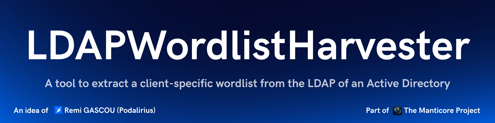
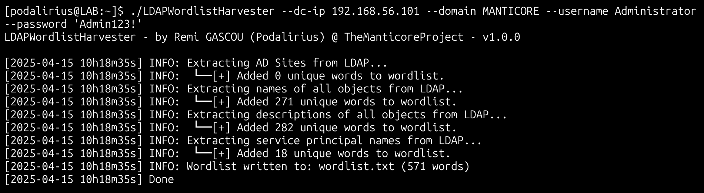

<p align="center">
      A tool that allows you to extract a client-specific wordlist from the LDAP of an Active Directory.
      <br>
      <a href="https://github.com/TheManticoreProject/LDAPWordlistHarvester/actions/workflows/release.yaml" title="Build"></a>
      
      
      <a href="https://twitter.com/intent/follow?screen_name=podalirius_" title="Follow"></a>
      <a href="https://www.youtube.com/c/Podalirius_?sub_confirmation=1" title="Subscribe"></a>
      <br>
</p>

## Features

- [x] Extract a client-specific wordlist from the LDAP of an Active Directory.
- [x] Support for LDAPS and LDAP.
- [x] Choose the output file with the option `--output`.

## Usage

```
$ ./LDAPWordlistHarvester -h
LDAPWordlistHarvester - by Remi GASCOU (Podalirius) @ TheManticoreProject - v1.0.0

Usage: LDAPWordlistHarvester --domain <string> --username <string> [--password <string>] [--hashes <string>] [--debug] [--output <string>] --dc-ip <string> [--ldap-port <tcp port>] [--use-ldaps] [--use-kerberos]

  Authentication:
    -d, --domain <string>   Active Directory domain to authenticate to.
    -u, --username <string> User to authenticate as.
    -p, --password <string> Password to authenticate with. (default: "")
    -H, --hashes <string>   NT/LM hashes, format is LMhash:NThash. (default: "")

  Configuration:
    -d, --debug           Debug mode. (default: false)
    -o, --output <string> Output file. (default: "wordlist.txt")

  LDAP Connection Settings:
    -dc, --dc-ip <string>       IP Address of the domain controller or KDC (Key Distribution Center) for Kerberos. If omitted, it will use the domain part (FQDN) specified in the identity parameter.
    -lp, --ldap-port <tcp port> Port number to connect to LDAP server. (default: 389)
    -L, --use-ldaps             Use LDAPS instead of LDAP. (default: false)
    -k, --use-kerberos          Use Kerberos instead of NTLM. (default: false)
```

## Demonstration

```
./LDAPWordlistHarvester --domain "MANTICORE" --username "Administrator" --password 'Admin123!' --dc-ip 192.168.56.101
```



## Contributing

Pull requests are welcome. Feel free to open an issue if you want to add other features.

## Credits
  - [Remi GASCOU (Podalirius)](https://github.com/p0dalirius) for the creation of the [LDAPWordlistHarvester](https://github.com/p0dalirius/LDAPWordlistHarvester) project before transferring it to TheManticoreProject.

